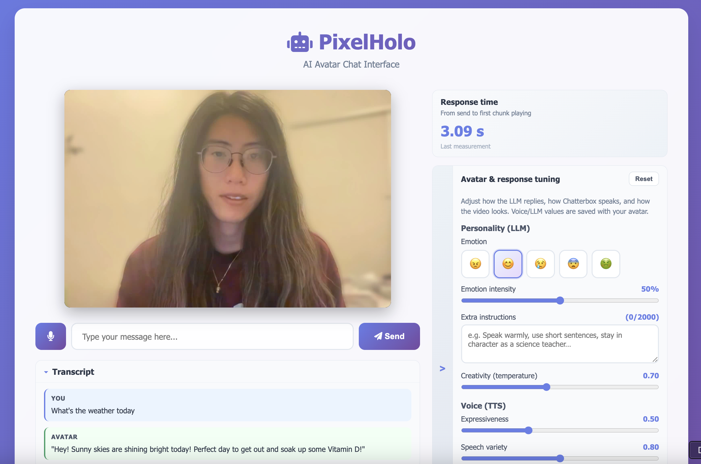
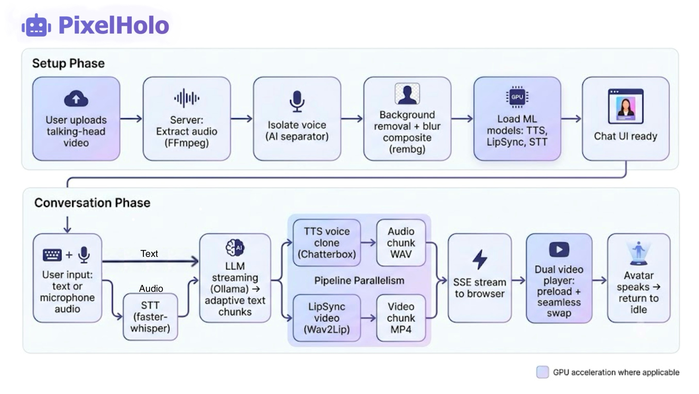
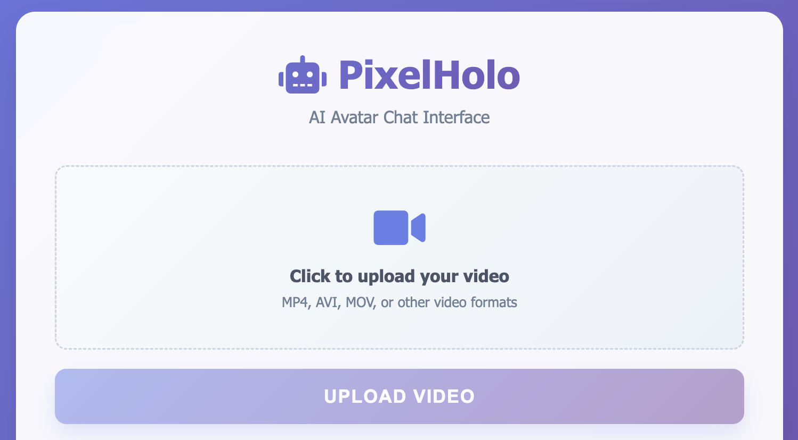
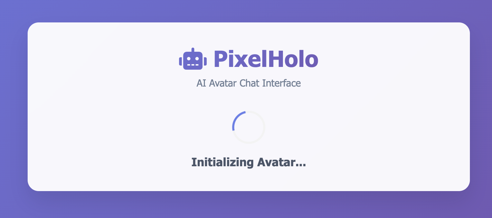
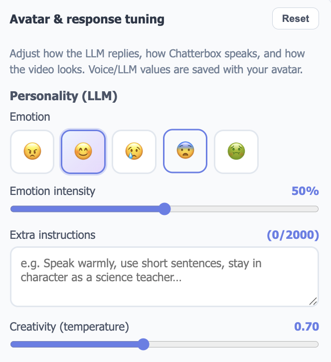
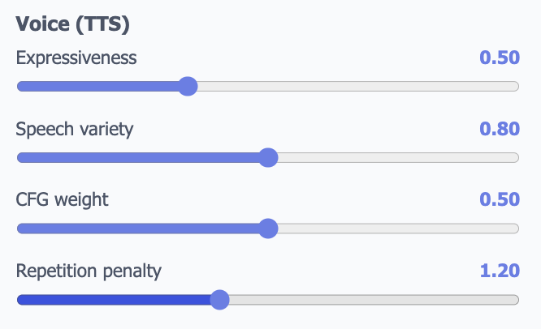
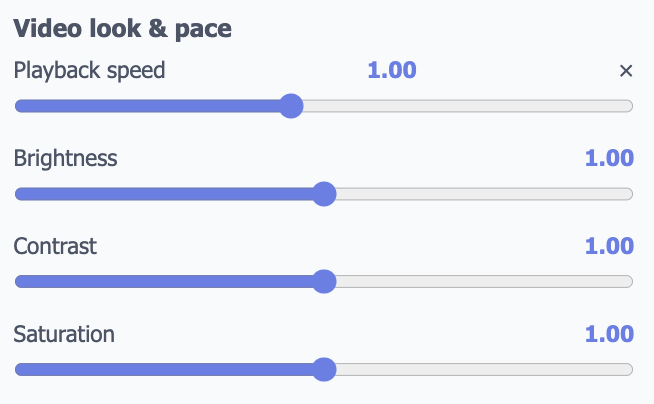
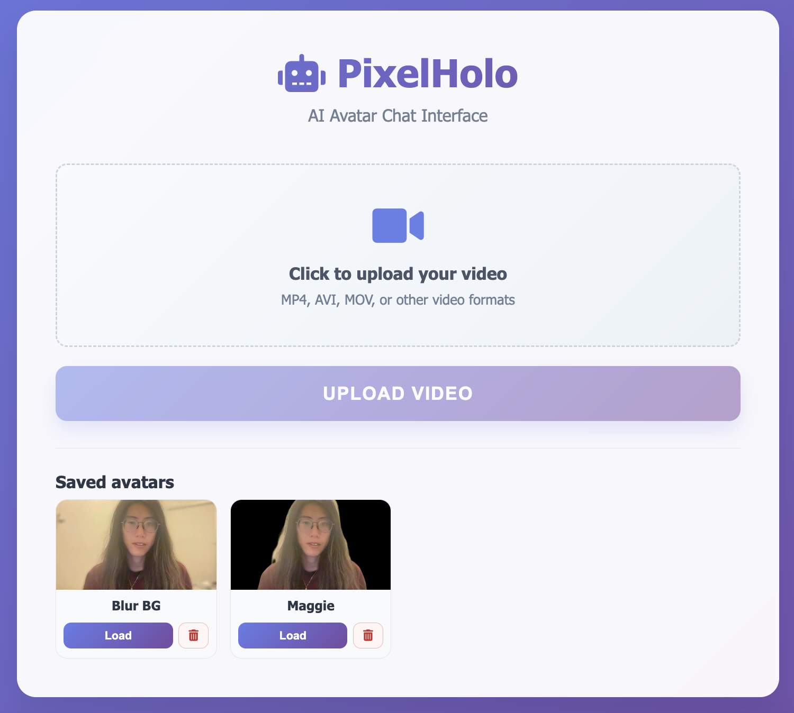

# PixelHolo - Interactive AI Avatar

## Overview

PixelHolo is an interactive AI avatar system that turns a short video of a person talking into a conversational digital clone. A user uploads a 1-2 minute clip of themselves (or anyone) speaking to the camera; the system extracts their voice and appearance, then lets others chat with that person in real time through a web interface. The avatar replies with cloned speech and lip-synced video, creating an experience similar to a live video call with an AI-powered version of that person.

The project combines several machine-learning components into a single end-to-end pipeline:

- **Voice cloning** — Chatterbox-TTS synthesizes speech in the uploaded person's voice.
- **Lip-sync video generation** — Wav2Lip (via the `lipsync` library) re-renders the source video so the person's mouth matches the generated audio.
- **Background compositing** — `rembg` segments the person frame-by-frame and composites them over a blurred copy of the original background, giving a clean live video call look.
- **Conversational AI** — Ollama (Llama 3.1) generates natural-language replies, with optional web search when a custom classifier detects that a question needs up-to-date information.
- **Low-latency streaming** — The LLM response is split into adaptive text chunks and processed in parallel (LLM → TTS → LipSync), so the first video clip can start playing in roughly two seconds while later chunks render in the background.
- **Web chat interface** — A Flask-hosted UI supports text input, browser microphone recording, saved avatars, session settings, and seamless chunked video playback with preloading.

Standout features developed during the project include the streaming chunk pipeline (adaptive chunk sizing, parallel TTS/LipSync workers, silence trimming, and speaker-embedding caching), the dual-video-player frontend for gap-free chunk transitions, server-side speech-to-text for audio input, persistent avatar saving/loading, customizable avatar personality settings, and blurred-background compositing for a holographic visual effect. Below is a preview of the chat interface.



---

## Project Workflow

PixelHolo runs as a local Flask server backed by GPU-accelerated ML models. The full lifecycle has two major phases: **avatar setup** (one-time per video) and **conversation** (repeated per user message). The flowchart of the project is shown below.



### Phase 1: Avatar Setup (Upload & Preprocessing)

1. **User uploads a video** through the web UI, as shown below. The clip should show the subject talking to the camera for at least one to two minutes. The user can optionally configure personality and TTS settings after upload.



After the user uploads the video, the loading screen shown below is displayed while the server processes the video, as described in Steps 2-6.



2. **Server receives and stores the video** at `POST /upload`. The file is saved under `runtime/uploads/video/`.

3. **Audio extraction and voice isolation**
   - FFmpeg extracts the audio track from the video into a WAV file.
   - An AI vocal separator (`audio-separator`) isolates the speaker's voice from background noise. The isolated vocal sample becomes the voice-cloning reference for Chatterbox-TTS. If isolation fails, the raw extracted audio is used as a fallback.

4. **Background removal and compositing**
   - Each frame of the video is processed with `rembg` (U²-Net model, GPU-accelerated when available) to produce a person segmentation mask.
   - The person is composited over a Gaussian-blurred copy of the original frame, so the background appears soft while the subject stays sharp. The processed video is saved as `processed_video.mp4`.

5. **Poster frame extraction**
   - The first frame of the processed video is saved as a static poster image. This image is shown in the chat UI as an idle state between video chunks, preventing black flashes during playback.

6. **Model initialization**
   - **Chatterbox-TTS** loads on GPU (or CPU fallback) and pre-caches speaker conditionals from the isolated voice sample, so later synthesis skips repeated speaker-encoding overhead.
   - **Wav2Lip (LipSync)** loads with pre-trained weights for per-chunk lip-sync rendering.
   - **faster-whisper (STT)** initializes on demand for transcribing browser-recorded audio input.

7. **Chat screen becomes available.** The UI transitions from the loading state to the talk screen, as shown below, displaying the avatar poster and input controls (text box, microphone button, settings panel).


### Phase 2: Conversation (Input → Generation → Playback)

When the user sends a message, the system runs a three-stage streaming pipeline orchestrated by `PipelineManager`:

#### Step 1: Capture user input

- **Text input** — The browser sends the message to `POST /chat`.
- **Audio input** — The browser records audio via the Web Audio API and sends it to `POST /chat_audio`. The server transcribes it with faster-whisper and then feeds the resulting text into the same pipeline.

#### Step 2: LLM response generation (streaming, chunked)

- The transcribed or typed text is sent to **Ollama** (Llama 3.1) via a streaming API call.
- If a custom ML classifier determines the query needs current information, the system performs a **web search** first and injects the results as context.
- As tokens arrive from the LLM, the response is split into **adaptive text chunks** using a ramp-up strategy: the first chunk is intentionally short (~5 words) so the avatar can start speaking quickly; later chunks grow (10 → 18 → 24 words) so rendering time stays within each chunk's playback duration.
- Each chunk is pushed into a text queue for the next stage.

#### Step 3: Parallel TTS and LipSync rendering

Two worker threads run concurrently, connected by queues:

| Thread | Input | Output | Model |
|--------|-------|--------|-------|
| **TTS worker** | Text chunk | Audio WAV (`chunk_N_audio.wav`) | Chatterbox-TTS |
| **LipSync worker** | Audio WAV | Video MP4 (`chunk_N_video.mp4`) | Wav2Lip |

While LipSync renders chunk *N*, the TTS worker is already synthesizing chunk *N+1*. This pipeline parallelism overlaps GPU-bound and CPU/ffmpeg-bound work without doubling VRAM usage. Each TTS output is silence-trimmed and generated with a fixed seed plus cached speaker embeddings to keep prosody consistent across chunks.

#### Step 4: Stream chunks to the browser

- The server exposes chunk readiness through **Server-Sent Events** (`GET /stream_events?pipeline_id=...`), pushing a notification the instant each video file is written (≈50 ms latency vs. earlier 500 ms polling).
- The frontend maintains a **dual-video-player** setup: one player shows the current chunk while the other preloads the next. On chunk end, the players swap with no fade or black frame—the poster image underneath provides a seamless backdrop.
- When all chunks finish, the full assistant response is appended to the conversation history and the UI returns to idle, ready for the next message.

<!-- #### End-to-end flow summary

```
User uploads video
       ↓
[Server] Extract audio → Isolate voice → Remove background (blur composite) → Extract poster
       ↓
[Server] Load TTS + LipSync + STT models → Pre-cache speaker embeddings
       ↓
Chat UI ready (poster displayed)
       ↓
User sends text or audio
       ↓
[Audio path] STT (faster-whisper) → text
       ↓
[Pipeline] LLM stream (Ollama) → adaptive text chunks
       ↓                    ↘
   TTS (Chatterbox)     LipSync (Wav2Lip)  ← parallel threads
       ↓                    ↓
   chunk audio WAV      chunk video MP4
       ↓
SSE push to browser → dual-player preload & swap → avatar speaks
       ↓
Idle (poster) → wait for next input
``` -->

--- 

## Key Features

The sections below describe the main features developed across past terms. Each follows the same structure: the problem we faced, the approach we took, how the implementation works, and the measured outcome.

---

### Streaming Chunks

#### The Challenge

In the original design, the avatar could not speak until the entire response pipeline finished. The system waited for Ollama to generate the full text reply, then ran Chatterbox-TTS on the complete passage, and only then invoked Wav2Lip to render a single lip-synced video. Even on our RTX 5090 workstation, this end-to-end pass routinely took **around 7 seconds** before the user saw or heard anything. For a conversational avatar, that delay felt unnatural — far slower than a human's typical one-to-three-second response pause.

The bottleneck was not any single model in isolation but the **serial dependency**: each stage blocked the next, and the user stared at a static poster image through the entire wait.

#### The Idea

Instead of treating the response as one monolithic unit, we reframed it as a **stream of short clips** that could be generated and played incrementally — similar to how a person starts speaking before they have fully formed every word of a sentence.

The core insight was twofold:

1. **Start small, grow later** — the first chunk of text should be as short as possible (~5 words) so TTS and LipSync can produce a playable clip quickly. Later chunks can be longer because the avatar is already talking and the user is occupied listening.
2. **Pipeline parallelism** — while LipSync renders chunk *N*, the TTS worker should already be synthesizing chunk *N+1*. This overlaps GPU-bound inference with CPU/ffmpeg work instead of running everything strictly in sequence.

#### How It Works

The streaming pipeline is implemented in `PipelineManager` (`pixelholo/pipeline.py`) as three cooperating threads connected by FIFO queues:

```
LLM thread  →  text_queue  →  TTS thread  →  audio_queue  →  LipSync thread  →  video_queue
```

**Adaptive chunk sizing.** As Ollama streams tokens, a chunking function accumulates words and decides when to cut. The target word counts ramp up across chunks: **5 → 10 → 18 → 24 words**. The first chunk is deliberately tiny so the avatar can start speaking in roughly one second. Later chunks grow because, by then, the previous clip is already playing and the user is listening — giving the pipeline more time to render without causing a visible gap.

The chunker uses three passes in priority order:

1. **Hard break** — cut at the earliest sentence-ending punctuation (`.`, `!`, `?`) once a minimum word count is met.
2. **Soft break** (early chunks only) — cut at commas, semicolons, or before conjunctions (`and`, `but`, `so`, etc.) once the soft target is reached.
3. **Force cut** — if the buffer exceeds a hard maximum, split regardless of punctuation.

This keeps chunks linguistically natural while respecting latency targets.

**Parallel TTS and LipSync workers.** The TTS thread pulls text chunks, synthesizes audio with Chatterbox, trims leading/trailing silence, and writes `chunk_N_audio.wav`. The LipSync thread pulls those audio files and renders `chunk_N_video.mp4` with Wav2Lip. Because the two threads run concurrently, LipSync GPU time for chunk *N* overlaps with TTS synthesis for chunk *N+1*.

**Chunk boundary hygiene.** To prevent audible "stitching" between clips, each TTS call uses a fixed random seed and pre-cached speaker embeddings (see Speed Optimizations below). Silence padding that Chatterbox sometimes adds (~50–150 ms per chunk) is stripped with `librosa.effects.trim` before LipSync, so consecutive chunks sound like one continuous sentence.

**Delivery to the browser.** Each finished video chunk is pushed to a `video_queue`. The server notifies the frontend through Server-Sent Events (`/stream_events`), and the browser begins playback as soon as the first chunk arrives.

#### Results

| Metric | Before (serial pipeline) | After (streaming chunks) |
|--------|------------------------|--------------------------|
| Time to first speech | ~7 s | **~3 s average** |
| Perceived responsiveness | Long static wait | Avatar starts talking while later chunks render |
| Multi-sentence replies | One long render, then one play | Continuous playback with no gap between chunks |

The ~3 second average "send → first chunk playing" measurement is tracked live in the UI's response-time panel. This is close to natural human conversational pacing (typically 1–3 seconds of thinking before speaking), making the interaction feel significantly more alive.

---

### Speed Optimizations

#### The Challenge

Streaming chunks addressed *when* the avatar starts speaking, but each individual chunk still had to be rendered as fast as possible. Several smaller bottlenecks added hundreds of milliseconds — or full seconds — across a multi-chunk reply: redundant speaker encoding on every TTS call, LLM responses that were too long for a hologram use case, polling latency between server and browser, and audible gaps caused by silence padding between chunks.

#### The Idea

Apply targeted optimizations at each stage of the pipeline rather than trying to speed up any single model. The goal was to shave time off the critical path (everything before the first chunk plays) while keeping later chunks rendering fast enough to stay ahead of playback.

#### How It Works

**LLM response length control.** The system prompt instructs Ollama to keep replies short (aiming for less than 7 seconds of speech). The API call sets `num_predict: 512` as a hard token ceiling. Together, these prevent the LLM from generating paragraphs that would require many chunks and long total render time.

**Speaker conditional caching.** Chatterbox-TTS normally re-encodes the voice reference sample on every `generate()` call (~150 ms each). At upload time, `tts.prepare_conditionals()` runs once and caches the speaker embedding. Subsequent per-chunk calls skip re-encoding, saving ~150 ms × number of chunks.

**Fixed TTS seed.** Each chunk's TTS call sets `torch.manual_seed(1234)` so the diffusion sampler starts from the same noise distribution. This prevents pitch and timbre drift between chunks, which previously caused subtle but noticeable voice changes mid-sentence.

**Silence trimming.** Chatterbox sometimes prepends or appends 50–150 ms of silence per chunk. Across four chunks, that compounds into ~200–600 ms of dead air. Each waveform is trimmed with `librosa.effects.trim` (35 dB threshold) and given a small 30 ms pad so boundaries do not sound clipped.

**Pipeline parallelism.** As described in Streaming Chunks, the TTS and LipSync threads overlap, saving significant time.
<!-- On a single GPU this does not double VRAM usage because only one model runs inference at a time, but it eliminates idle gaps where the GPU waited for CPU/ffmpeg work or vice versa. -->

**SSE instead of polling.** The original frontend polled `/stream_status` every 500 ms to check for new chunks. This added an average ~250 ms delay between a chunk being written and the browser learning about it. Server-Sent Events (`/stream_events`) push notifications within ~50 ms of each chunk becoming ready.

**Adaptive chunk growth tuning.** Early iterations used uniform 12-word chunks. Tuning the ramp to `[5, 10, 18, 24]` and raising later targets from 12 → 24 words improved the balance between first-chunk speed and total throughput. Each chunk's render time stays below the previous chunk's playback duration, so the pipeline never falls behind.

#### Results

These optimizations compound across a typical multi-chunk reply:

- **~150 ms saved per chunk** from speaker conditional caching (e.g., 4 chunks → ~600 ms total).
- **~250 ms saved per chunk notification** from SSE vs. polling.
- **~200–600 ms saved** across a reply from silence trimming.
- **Shorter LLM output** reduces total chunk count, directly reducing total render time.

Combined with streaming chunks, the system went from a **~7 s wait** for any response to a **~3 s average** wait for the first chunk, with subsequent chunks arriving seamlessly during playback.

---

### Web UI and Seamless Video Playback

#### The Challenge

Even after chunks rendered quickly, the playback experience broke the illusion of a live avatar. The original approach used a single `<video>` element: when one chunk ended, the player had to load the next file, causing a visible black flash or frozen frame between clips. Users perceived the avatar as "stuttering" rather than speaking naturally. There was also no visual feedback for how long they had been waiting, and the interface was a basic upload form with no chat layout.

#### The Idea

Treat video playback as a **continuous broadcast** rather than a sequence of discrete file loads. Keep something visible on screen at all times (a poster image of the avatar's first frame), preload the next chunk in a hidden player before the current one ends, and swap players instantly when the handoff is ready.

#### How It Works

**Two-layer video stack.** The chat screen uses two stacked `<video>` elements (`videoPlayerA` and `videoPlayerB`) sitting above a static poster image (`` of the avatar's first frame). One player is "front" (visible, playing) and the other is "back" (hidden, preloading the next chunk).

**Preload-and-swap handoff.** When chunk *N* is playing on the front player, chunk *N+1* is loaded into the back player. On the front player's `ended` event:

1. The front player enters a "hold" state — its last frame stays visible (no black screen).
2. The back player starts playing. On its `playing` event, the roles swap: the back player becomes front, the old front player is cleared and becomes the new back player.
3. If the next chunk is already in the queue, it is immediately preloaded into the new back player.

A fallback timer handles edge cases where the back player is not ready in time, preventing indefinite holds.

**Response time panel.** A live counter in the sidebar measures elapsed time from "send" to "first chunk playing," giving users and developers immediate feedback on pipeline latency. The timer resets on each new message and shows an error state if generation fails.

**Chat layout.** The UI has two states: an upload screen (drag-and-drop video, optional saved-avatar picker) and a chat screen (video panel + sidebar with transcript, settings, save controls, and input bar). The layout expands to a wider container when chat is active, with the video panel on the left and controls on the right.

#### Results

- **No visible black frames** between chunks during multi-sentence replies.
- The avatar appears to **speak continuously**, as if delivering one uninterrupted response.
- Users can see **live response-time feedback** (~3 s average) directly in the UI.
- The chat layout makes the interaction feel like a messaging app with a live video avatar, not a demo script.

---

### Audio Input

#### The Challenge

The original PixelHolo required a desktop OpenCV window, an external microphone, and pressing the spacebar to talk. Google's cloud speech-to-text API handled transcription. This setup was impractical for a web-based experience — users on phones or remote devices (via Cloudflare tunnel) could not easily converse with the avatar.

#### The Idea

Move speech input into the browser itself. The user holds a microphone button to record, the browser captures audio via the Web Audio API / MediaRecorder, and the server transcribes it locally with an open-source STT model before feeding the text into the same streaming pipeline used for typed messages.

#### How It Works

**Browser-side recording.** The chat UI provides a hold-to-talk microphone button (with touch support for mobile). While held, the browser records audio (typically as WebM). On release, the audio blob is sent to `POST /chat_audio` as a multipart upload.

**Server-side transcription.** The server saves the audio to a temporary file and runs it through **faster-whisper** (Whisper `base` model, GPU-accelerated with `float16` when available). Voice activity detection (`vad_filter`) strips silence before transcription. The resulting text is printed to the terminal and passed to `PipelineManager` — the same streaming pipeline used for typed input.

**Unified pipeline.** Whether the user types or speaks, the downstream path is identical: LLM stream → adaptive chunks → TTS → LipSync → SSE → browser playback. The transcribed text is also shown in the chat input area so the user can verify what was heard.

#### Results

- Users can talk to the avatar **directly through the web browser**, including on mobile via Cloudflare tunnel.
- No dependency on Google's cloud STT or an external microphone.
- Audio and text input share the same low-latency streaming pipeline, so voice conversations benefit from all chunk and speed optimizations.

---

### User Control Panel

#### The Challenge

A cloned avatar that always sounds and looks the same limits the experience. Different use cases call for different personalities (cheerful guide vs. serious assistant), voice expressiveness, and visual presentation. Hard-coding these values or requiring a re-upload to change them was not practical.

#### The Idea

Expose a session-level settings panel in the chat sidebar that adjusts LLM personality, TTS voice characteristics, and video appearance in real time — no re-upload or server restart required. Settings persist when saving/loading avatars.

#### How It Works

The **Avatar & response tuning** drawer (`/session/settings`) controls three layers:

**Personality (LLM)**

| Control | Effect |
|---------|--------|
| Emotion preset (happy, sad, angry, scared, disgust) + intensity slider | Injects a tone description into the system prompt (e.g., "happy, cheerful, and upbeat at 70% intensity") |
| Extra instructions (free text, up to 2000 chars) | Appended to the system prompt for role-playing or style guidance |
| Creativity / temperature (0.1–1.5) | Controls Ollama sampling randomness |



**Voice (TTS — Chatterbox parameters)**

| Control | Effect |
|---------|--------|
| Expressiveness / exaggeration (0.25–1.0) | How animated or flat the delivery sounds |
| Speech variety / temperature (0.4–1.2) | Randomness in speech token selection |
| CFG weight (0–1) | How strongly the model adheres to voice + text conditioning |
| Repetition penalty (1.0–1.5) | Suppresses stuttering or looping sounds |



**Video look & pace**

| Control | Effect |
|---------|--------|
| Playback speed (0.6×–1.5×) | `playbackRate` on both video players (audio is baked in, so lip-sync stays aligned) |
| Brightness, contrast, saturation | CSS `filter` on the video container — instant preview, no re-encode |



Settings are sent to the server via `POST /session/settings` and applied to the next pipeline run. When an avatar is saved, all current settings are stored in `meta.json` and restored on load.

#### Results

- Users can **fine-tune the avatar's personality and voice** without re-uploading video.
- Emotion presets let the same cloned face deliver different moods on demand.
- Video color and speed adjustments help match different display setups (e.g., bright acrylic hologram vs. dim room).

---

### Saved Avatars, Transcript, and Live Metrics

#### The Challenge

Re-uploading a one-to-two-minute video and waiting for full preprocessing (background removal, voice isolation, model loading) every session was slow and repetitive. Users also had no record of what was said during a conversation, and no easy way to compare pipeline performance across sessions.

#### The Idea

Persist the entire avatar bundle (video, processed clip, voice sample, poster, and settings) to disk so it can be reloaded instantly. Show a running transcript of the conversation and display live response-time metrics in the UI.

#### How It Works

**Saved avatars.** After setup, the user names the avatar and clicks "Save." The server copies the input video, isolated voice WAV, processed video (if available), poster frame, and current session settings into `runtime/saved_avatars/<id>/`. A `meta.json` file stores the display name, creation date, and preferences. Loading a saved avatar skips upload and preprocessing — files are copied back into the runtime directories and models are re-initialized. Saved avatars appear in a picker on the upload screen as shown below.



**Transcript panel.** A collapsible sidebar section fetches `/session/transcript` and displays the conversation history as labeled entries (User / Avatar). Messages are appended after each completed pipeline run. The history is capped at the 20 most recent turns on the server.

**Live response time.** The response-time panel measures wall-clock time from the moment the user sends a message (text or audio) to the moment the first video chunk begins playing. This metric is displayed in the sidebar and logged to the browser console, making it easy to verify the impact of pipeline changes during development.

#### Results

- **Avatar reload in seconds** instead of minutes (no re-upload, no background removal).
- Full **conversation history** visible in the UI for review or demonstration.
- **Live latency metric** confirms the ~3 s average response time and helps catch regressions.

---

## Future Steps

### 1) Physical Hologram Display Integration

The current system focuses on the web interface and live-avatar conversation flow. A major next step is to deploy PixelHolo into a physical hologram setup using a monitor + acrylic (or similar optical) display path. This includes tuning brightness/contrast for projection surfaces, designing a stable enclosure, and calibrating viewing angles so the avatar appears consistent in real environments.

### 2) Replace Wav2Lip with a Commercial-Friendly Lip-Sync Model

The current lip-sync stack is effective for prototyping, but the report already notes licensing constraints for commercial use. A key improvement is to migrate to a production-safe model with comparable visual quality, then benchmark latency/quality trade-offs and retrain or fine-tune as needed.

### 3) Real-Time Personalized Avatars with Multi-Profile Context

Right now, users can save and load avatars plus session preferences. The next step is a richer profile memory layer: long-term persona memory, context-aware responses across sessions, and per-avatar knowledge packs (documents, FAQs, custom prompts) so each avatar can become a persistent assistant, not only a cloned voice/video identity.

### 4) Cloud Deployment and Multi-User Scaling

The current architecture is local-first, which is great for development but limits concurrent usage. A future milestone is to split services (UI/API, LLM, TTS, lip-sync workers) into scalable components, add queue-based job scheduling, and support concurrent sessions with GPU resource management and observability (latency, errors, throughput).